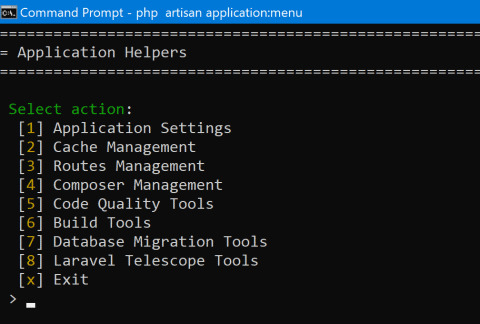

## Welcome
Welcome to the source code for my personal portfolio website - grab a coffee, pull up a chair and enjoy the horrors contained within.

The code is based on Laravel 8 and is supplied as is for reference purposes only.

This initial 1.0 release has had the git history flattened to remove commits and present a clean starting point for future additions.

## Laravel Overrides
There are a few changes to the typical laravel skeleton

1. The bootstrap has been move to a class file. app.php had to be kept as there are several hard dependencies to it in the framework (!@@###$$!!!).
2. The application class has been overridden to move a number of the cache folders. Laravel is all over the place here, some folders have .env overrides and some are hard coded -  feel a pull request looming.
3. The folder structure has been rearranged to be similar to the Symfony guidelines.
4. The projects features are in the modules folder, typically broken down into 'service' (business rules) and repository (db entry point). Service providers setup any template or component dependencies.

## Scripts/Artisan Console

### Storage folders
Run 'composer create-storage-folders' to create any missing storage folders.

### Development Mode
Disable development mode 'composer run development-disable'  
Enable development mode 'composer run development-enable'  
Display Development mode status 'composer run development-status'  

### Artisan console helper

The application includes a console helper that wraps common artisan commands and includes project build and testing helpers.

php artisan application:menu

## Fun facts
If you have optimised laravel and created caches this can cause issues in testing that will result in your development database being rolled back instead of the test database due to cached model db references - always ensure you clear the caches prior to testing.

So I no longer need to concern myself with this I added cache clearing to the create application trait - see Tests\CreateApplicationTrait

## Docker
Setup the .env file (copy over .env.example) and run 'docker compose up -d'

*Create the storage folder and update composer*  
To speed docker up the storage and vendor folders are now local to the box

1. docker exec -it lampserver-php /bin/bash  
2. composer run create-storage-folders
3. chmod -R 777 storage (THIS LOCAL DEV BOX ONLY!! - NEVER ON PRODUCTION)
4. composer update

*Run the database migrations (initial build)*

1. php artisan application:menu
2. Select 1 "Application Settings"
3. Select 6 "Create Application"
4. Go to http://localhost:8080

### URL's
* **PHP Application** - http://localhost:8080
* **PhpMyadmin** - http://localhost:8888

### Bash
docker exec -it lampserver-php /bin/bash  
docker exec -it lampserver-phpmyadmin /bin/bash  
docker exec -it lampserver-mysql /bin/bash  
